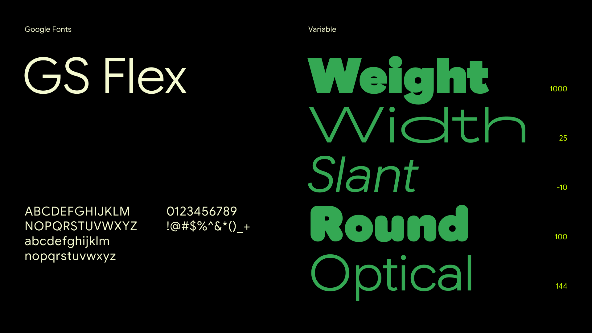

# MyMileage

MyMileage is an Android app for tracking mileage 🚙, fuel usage ⛽, and trip history 📅. It is built with Jetpack Compose and Material 3 Expressive for a clean, modern experience.

Use it to manage vehicles 🚘, log trips 🛣️, and monitor fuel efficiency 📊 in one place.

## Download

* (Recommended) Get MyMileage on Google Play.

* (Not recommended) [Get it on GitHub](https://github.com/ygllc/MyMileage)

<figure><picture><source srcset=".gitbook/assets/GitHub_Lockup_White_Clearspace.png" media="(prefers-color-scheme: dark)"></picture><figcaption></figcaption></figure>

## Features

* **🚘 Vehicle management:** Add, edit, and remove vehicle profiles with details like make, model, year, fuel type, icon, and registration number.
* **🛣️ Trip logging:** Record start mileage, end mileage, and fuel filled. MyMileage calculates distance and fuel efficiency automatically.
* **📝 Draft and completed trips:** Save incomplete entries as drafts, then finish them later.
* **📂 Trip history and filters:** Browse trip history and filter by all, completed, or draft trips.
* **📋 Vehicle overview:** View and manage your vehicles in a simple grid layout.
* **🔐 Multiple sign-in options:** Sign in with Google, Microsoft, email, or phone[^1].

MyMileage helps you stay organized, track efficiency, and keep clear records across one or more vehicles 🚗.

## Contributing

You can support MyMileage by downloading the app, sharing feedback, and suggesting improvements 💡.

Send suggestions to [unmesh.ghadi@gmail.com](mailto:unmesh.ghadi@gmail.com) or open an issue on [GitHub](https://github.com/ygllc/MyMileage/issues) or [YouTrack](https://ygllc.youtrack.cloud/projects/MYMILPUB).

## Fonts

* [Roboto Flex](https://fonts.google.com/specimen/Roboto+Flex) by Google

<figure><figcaption></figcaption></figure>

* [Google Sans Flex](https://fonts.google.com/specimen/Google+Sans+Flex)

<figure><figcaption></figcaption></figure>

* Roboto Mono

<figure><figcaption></figcaption></figure>

## Star History

<figure><figcaption></figcaption></figure>

[^1]: Phone sign-in is currently in progress
